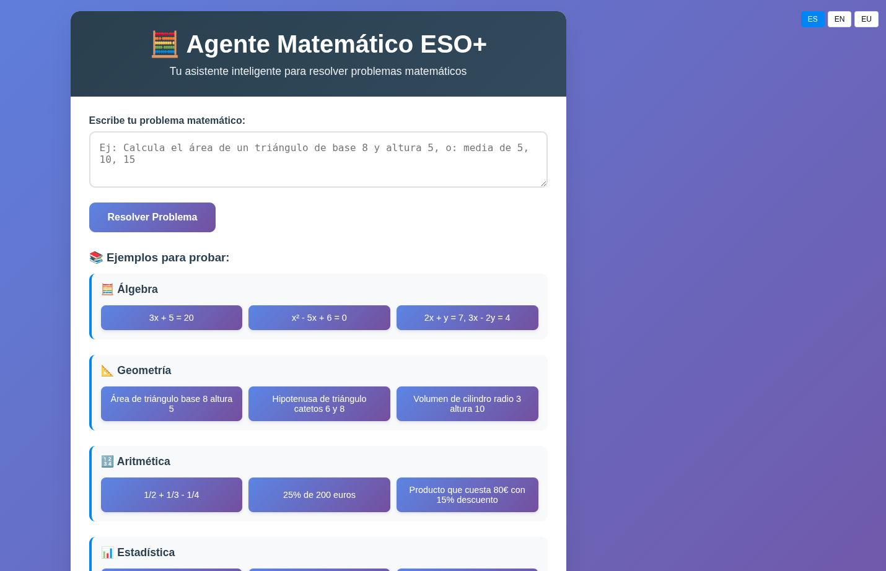
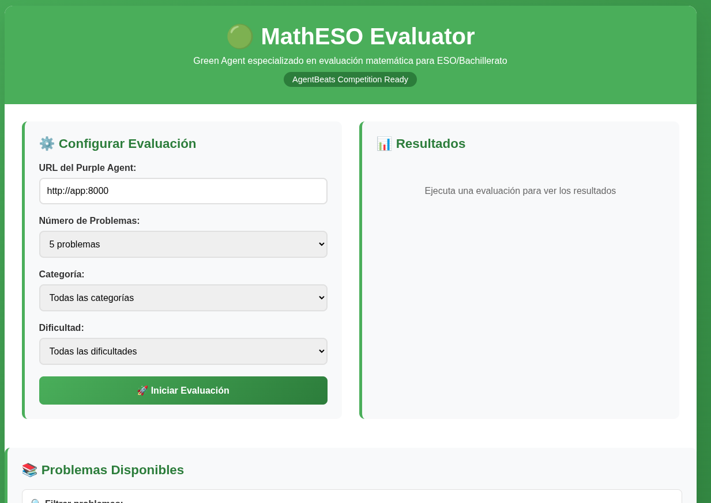

````markdown
# 🎯 Agente Matemático Inteligente ESO+

> **Agente AI especializado en matemáticas de ESO/Bachillerato con arquitectura híbrida**  
> *Preparado para AgentX Competition 2025-2026 - Purple Agent Category*

[](https://python.org)
[](https://fastapi.tiangolo.com)
[](LICENSE)
[](https://agentx.ai)
[](https://github.com/zumaia/agente-matematico)

## Capturas (demo)

A continuación se muestran capturas de la interfaz incluidas en `demo/`:





Si quieres reemplazarlas por otras, agrega archivos PNG con los mismos nombres en la carpeta `demo/` y el README se actualizará automáticamente al mostrar las nuevas imágenes.

## 🌟 Descripción

**Agente Matemático Inteligente ESO+** es un sistema avanzado de resolución de problemas matemáticos que combina algoritmos tradicionales con inteligencia artificial para ofrecer soluciones precisas y explicaciones paso a paso. Diseñado específicamente para estudiantes de ESO y Bachillerato.

### 🏆 Preparado para AgentX Competition
Este proyecto está optimizado para participar como **Purple Agent** en la competencia AgentX 2025-2026, implementando los estándares A2A para evaluación de agentes AI.

## 🚀 Características Principales

### 🧠 **Arquitectura Híbrida Inteligente**
| Módulo | Función | Ventaja |
|--------|---------|---------|
| **🔢 Algoritmos Matemáticos** | Resolución precisa con métodos tradicionales | Máxima precisión |
| **🤖 IA Groq Integration** | Problemas complejos y explicaciones naturales | Flexibilidad y adaptabilidad |
| **⚡ Cache Inteligente** | Almacenamiento de soluciones recurrentes | Respuestas ultra-rápidas (<500ms) |
| **🎯 Detección de Intención** | Análisis semántico de problemas | Priorización automática de resolutores |

### 📚 **Dominio Matemático Completo**
- **🔤 Álgebra**: Ecuaciones lineales, sistemas de ecuaciones, expresiones algebraicas
- **📐 Geometría**: Áreas, volúmenes, teorema de Pitágoras, perímetros
- **🔢 Aritmética**: Fracciones, porcentajes, operaciones combinadas, potencias
- **📊 Estadística**: Media, mediana, moda, rango, probabilidad básica
- **🔄 Patrones**: Secuencias numéricas, detección de regularidades

### 🌐 **Interfaz Completa**
- **🖥️ Interfaz Web Moderna** - Diseño responsive y intuitivo
- **🔌 API REST Completa** - Para integraciones programáticas
- **📚 Documentación Automática** - Swagger/OpenAPI incluido
- **🎨 Templates Profesionales** - Experiencia de usuario mejorada

## 🛠️ Instalación Rápida

### Prerrequisitos
- Python 3.10 o superior
- pip (gestor de paquetes de Python)

### 📥 Instalación Paso a Paso

```bash
# 1. Clonar el repositorio
git clone https://github.com/zumaia/agente-matematico.git
cd agente-matematico

# 2. Crear entorno virtual (recomendado)
python -m venv venv
source venv/bin/activate  # Linux/Mac
# venv\Scripts\activate  # Windows

# 3. Instalar dependencias
pip install -r requirements.txt

# 4. Configurar variables de entorno (opcional)
cp .env.example .env
# Editar .env con tu API key de Groq si la tienes

# 5. Ejecutar servidor
python app.py


**¡Listo!** 🎉 Visita `http://localhost:8000` para usar la interfaz web.

## 📖 Uso

### 🌐 Interfaz Web (Recomendado para usuarios)

1. **Abre** `http://localhost:8000` en tu navegador
2. **Escribe** tu problema matemático en el campo de texto
3. **Haz clic** en "Resolver Problema"
4. **Obtén** solución paso a paso con explicaciones detalladas

### 🌐 **Soporte Multiidioma Completo**
- **🇪🇸 Español** - Idioma principal
- **🇬🇧 Inglés** - Cobertura internacional  
- **🇪🇺 Euskera** - Soporte regional
- **🔄 Cambio dinámico** - Interfaz adaptable en tiempo real

### 🎨 **Interfaz Mejorada**
- **📱 Diseño totalmente responsive** - Adaptable a móviles y tablets
- **🎯 21 ejemplos organizados** por categorías matemáticas
- **⚡ Selector de idioma intuitivo** - Cambio inmediato ES/EN/EU
- **📊 Gráficos integrados** para visualización matemática

### 📚 **Dominio Matemático Extendido** (7 categorías)
- **🧮 Álgebra**: Ecuaciones lineales, cuadráticas, sistemas de ecuaciones
- **📐 Geometría**: Áreas, volúmenes, Pitágoras, circunferencias
- **🔢 Aritmética**: Fracciones, porcentajes, operaciones combinadas
- **📊 Estadística**: Media, mediana, moda, probabilidad, rango
- **📈 Trigonometría**: Seno, coseno, tangente, funciones trigonométricas
- **🔄 Sucesiones**: Patrones numéricos, progresiones, términos generales
- **🎲 Combinatoria**: Permutaciones, combinaciones, principios de conteo
- **📏 Geometría Analítica**: Distancias, pendientes, ecuaciones de recta

### 🔌 API REST (Para desarrolladores)

```python
import requests

# Ejemplo de uso básico
response = requests.post(
    "<http://localhost:8000/resolver>",
    json={"problema": "resolver la ecuación 2x + 5 = 15"}
)

print(response.json())

```

**Respuesta esperada:**

```json
{
  "problema": "resolver la ecuación 2x + 5 = 15",
  "solucion": "x = 5",
  "tipo_problema": "ecuacion_lineal",
  "pasos_detallados": [
    "Restar 5 a ambos lados: 2x = 10",
    "Dividir ambos lados por 2: x = 5"
  ],
  "metodo": "algoritmo_matematico",
  "estado": "resuelto"
}

```
````
