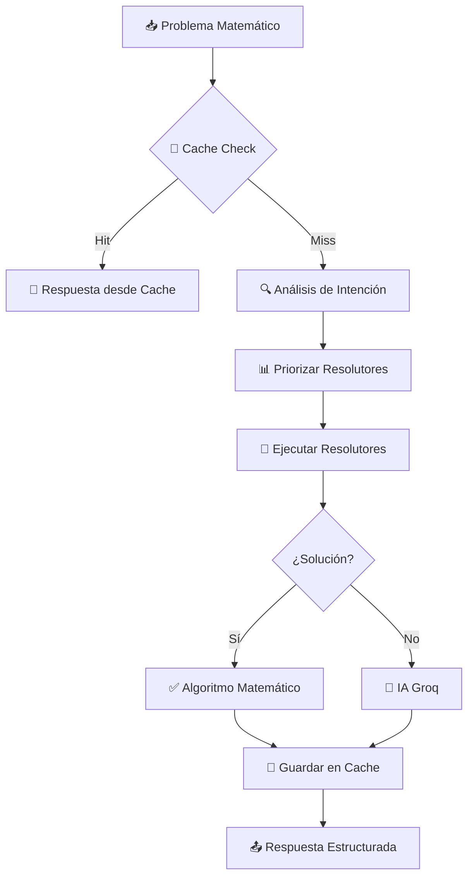

¡Perfecto! Vamos con la documentación de arquitectura.

## 🏗️ **`docs/ARCHITECTURE.md` - Arquitectura Técnica**

```markdown
# 🏗️ Arquitectura del Sistema - Agente Matemático

## 📐 Visión General

El Agente Matemático ESO+ sigue una **arquitectura modular híbrida** que combina algoritmos matemáticos tradicionales con inteligencia artificial para ofrecer soluciones precisas y explicaciones detalladas.

## 🎯 Principios de Diseño

- **Modularidad**: Cada componente es independiente y especializado
- **Hibridación**: Algoritmos + IA para equilibrio precisión/flexibilidad
- **Escalabilidad**: Fácil añadir nuevos módulos matemáticos
- **Rendimiento**: Cache inteligente para respuestas rápidas
- **Mantenibilidad**: Código limpio y documentado

## 📁 Estructura del Proyecto

```
agente-matematico/
├── 📁 matematica/               # Núcleo matemático
│   ├── __init__.py
│   ├── algebra.py              # Resolutores algebraicos
│   ├── geometria.py            # Funciones geométricas
│   ├── aritmetica.py           # Operaciones aritméticas
│   ├── estadistica.py          # Cálculos estadísticos
│   ├── patrones.py             # Detección de intención
│   ├── ia.py                   # Integración Groq AI
│   ├── cache.py                # Sistema de cache
│   └── utils.py                # Utilidades compartidas
├── 📁 templates/               # Capa de presentación
│   ├── index.html             # Interfaz principal
│   └── solucion.html          # Página de resultados
├── 📁 static/                 # Recursos estáticos
│   ├── style.css
│   └── favicon.ico
├── 📁 docs/                   # Documentación
├── app.py                     # Servidor FastAPI
├── requirements.txt           # Dependencias
└── README.md                  # Documentación principal
```

## 🔄 Diagrama de Flujo de Resolución



## 🧩 Módulos del Sistema

### **1. 🎪 Capa de Presentación (FastAPI)**
**Archivo**: `app.py`
**Responsabilidad**: Manejar requests HTTP y servir la interfaz web

```python
# Endpoints principales
@app.get("/")              # Interfaz web
@app.post("/resolver")     # API JSON
@app.post("/resolver-web") # Web form
@app.get("/cache/estado")  # Monitorización
```

### **2. 🧮 Núcleo Matemático (`matematica/`)**

#### **`algebra.py`** - Resolución algebraica
```python
def resolver_ecuacion_lineal(problema):
    # Resuelve ecuaciones como "2x + 5 = 15"
    # Retorna: {"solucion": "x = 5", "pasos": [...], "tipo": "ecuacion_lineal"}

def sistemas_ecuaciones(problema):
    # Resuelve sistemas de ecuaciones
```

#### **`geometria.py`** - Cálculos geométricos
```python
def calcular_area(problema):
    # Áreas de figuras: círculo, triángulo, cuadrado, etc.

def teorema_pitagoras(problema):
    # Aplica teorema de Pitágoras

def calcular_volumen(problema):
    # Volúmenes de sólidos geométricos
```

#### **`aritmetica.py`** - Operaciones básicas
```python
def operaciones_fracciones(problema):
    # Suma, resta, multiplicación, división de fracciones

def calcular_porcentajes(problema):
    # Cálculo de porcentajes y descuentos
```

#### **`estadistica.py`** - Análisis estadístico
```python
def calcular_media(problema)      # Media aritmética
def calcular_mediana(problema)    # Mediana
def calcular_moda(problema)       # Moda
def calcular_rango(problema)      # Rango
def probabilidad_basica(problema) # Probabilidad simple
```

### **3. 🧠 Módulo de Inteligencia (`patrones.py`)**

#### **Detección de Intención**
```python
def analizar_intencion(problema):
    # Analiza el problema para determinar el tipo matemático
    # Retorna: "algebra", "geometria", "aritmetica", etc.

def priorizar_resolutores(problema, resolutores):
    # Ordena resolutores basado en la intención detectada
    # Ejemplo: Para "área del círculo" → [calcular_area, ...]
```

### **4. 🤖 Integración IA (`ia.py`)**

#### **Resolución con Groq**
```python
def resolver_con_groq(problema):
    # Usa Groq API para problemas complejos
    # Fallback cuando los algoritmos no pueden resolver
```

**Configuración**:
```python
# Carga desde variables de entorno
GROQ_API_KEY = os.getenv('GROQ_API_KEY')
client = Groq(api_key=GROQ_API_KEY) if GROQ_API_KEY else None
```

### **5. ⚡ Sistema de Cache (`cache.py`)**

#### **Cache en Memoria y Disco**
```python
class CacheGlobal:
    def __init__(self, archivo="matematica_cache.json"):
        self.cache = {}
        self.archivo = archivo
        self.cargar_cache()
    
    def obtener(self, clave):
        # Retorna solución desde cache si existe
    
    def guardar(self, clave, valor):
        # Guarda solución en cache (memoria + disco)
```

**Estrategia**: Cache por problema textual para respuestas instantáneas

### **6. 🛠️ Utilidades (`utils.py`)**

#### **Procesamiento de Texto**
```python
def procesar_pasos_detallados(pasos_texto):
    # Convierte texto de pasos en lista estructurada
    # Limpia markdown y formatea para presentación
```

## 🔗 Flujo de Datos

### **Request → Response**
1. **Entrada**: Usuario envía problema matemático
2. **Procesamiento**:
   - Verificación de cache
   - Análisis de intención
   - Ejecución de resolutores priorizados
   - Fallback a IA si es necesario
3. **Salida**: Estructura estandarizada con solución y pasos

### **Estructura de Respuesta**
```python
{
    "problema": "texto original",
    "solucion": "respuesta final",
    "tipo_problema": "categoría matemática",
    "pasos_detallados": ["paso 1", "paso 2", ...],
    "metodo": "algoritmo_matematico|ia_groq|cache",
    "estado": "resuelto|error"
}
```

## 🎯 Patrones de Diseño

### **Strategy Pattern** - Resolutores Matemáticos
Cada función resolutora sigue la misma interfaz:
```python
def resolutor(problema) -> dict | None
```

### **Chain of Responsibility** - Priorización
Los resolutores se ejecutan en orden de prioridad basado en la intención detectada.

### **Decorator Pattern** - Cache
El cache envuelve las operaciones de resolución transparentemente.

## 📊 Métricas de Rendimiento

| Componente | Métrica | Valor Objetivo |
|------------|---------|----------------|
| **Cache** | Hit Rate | >60% |
| **Algoritmos** | Accuracy | >90% |
| **IA Groq** | Fallback Rate | <10% |
| **Tiempo Respuesta** | P95 | <2s |
| **Disponibilidad** | Uptime | >99% |

## 🔮 Extensiones Futuras

1. **Más Dominios Matemáticos**: Cálculo, trigonometría, etc.
2. **Gráficos y Visualizaciones**: Representación visual de soluciones
3. **Multi-idioma**: Soporte para otros idiomas
4. **APIs Externas**: Integración con Wolfram Alpha, etc.
5. **Aprendizaje**: Mejora continua basada en feedback

---

**¿Preguntas sobre la arquitectura?** Consulta los módulos individuales en `docs/MODULES.md`
